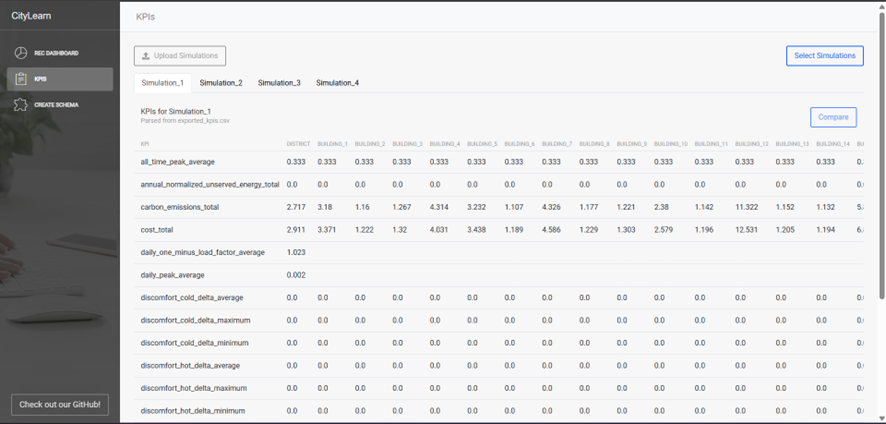

# CityLearn UI

CityLearn UI is a visual dashboard for exploring simulation data generated by the CityLearn  framework.
It was developed to simplify the analysis of results from smart energy communities, district energy coordination, demand response (among other applications), allowing users to visually inspect building-level components, compare simulation KPIs, and create simulation schemas with ease.

The interface is available in two options:

* Web app: https://citylearn-ui.softcps.org (free hosted version — not recommended for sensitive/personal data)
* Open-source code: github.com/SoftCPS/citylearn-ui

**Compatibility**: This version of the UI currently supports CityLearn v2.4 simulation data.

**Developed by:**
SoftCPS, Software for Cyber-Physical Systems (SoftCPS) research group (ISEP, Portugal) in collaboration with the Intelligent Environments Lab, University of Texas at Austin

## Exporting Data From CityLearn into CityLearn UI

To use this UI, your simulation results must be exported in a specific folder structure and naming format. CityLearn does this automatically.

The system uses the render() method, part of the OpenAI Gym interface, to automatically export data at each simulation step. This method loops through all elements of the environment—buildings, electric vehicles, batteries, chargers, etc.—collecting their states and the data they contain through calls to as_dict methods. The render method then saves the data to disk in CSV files organized by entity. Each row represents a time instant, and the columns contain the values of variables (such as energy consumption or state of charge), with units included in the column name.

The time instant is converted from timesteps, which are sequential numbers that the Simulator uses for day/month/year hour:minute:second dates. If you want to toggle this feature off, you can comment the render method in code. A feature to turn this off through the schema is being added in the near future.

# Pages within CityLearn UI

CityLearn UI has 3 main pages, each with its own functionalities. Following, we describe functionality and give a short explanation on how to use it.

## Dashboard Overview

This is the landing page users see when they first open the application. It allows you to upload and explore data from simulations.

### Uploading Simulations

Start by clicking "Upload Simulations" to open your file explorer. You’ll need to select a folder structured as follows:

* The main folder must be named SimulationData.
* Inside, include subfolders named after each simulation.
* Each simulation folder should contain CSV files with specific naming conventions:
    * **Buildings:** exported_data_building_X where X is the building number
    * **Components:** add a suffix like "_battery" or "_charger_X_Y" where X is the building number and Y is the building component number
    * **Episodes:** always end filenames with _epZ, where Z is the episode number
(e.g., exported_data_building_1_battery_ep3.csv)
Make sure all file and folder names follow this format to avoid errors.

### Selecting Simulations

Once a valid folder is uploaded, a "Select Simulations" button will appear. Clicking it opens a window where you can choose which simulations to view. The “Confirm” button will only activate once at least one simulation is selected.

### Viewing Simulation Data

After confirming, each selected simulation will appear as a tab on the page. Inside each tab:

* A sidebar on the left lists all elements in the simulation (e.g., buildings).
* Each building contains components grouped into:
    * Consumption
    * Production
    * Other Equipments (like Batteries, Chargers, etc.)
* Selecting a component displays its corresponding graph on the right side of the screen.

This layout makes it easy to navigate and analyze simulation data by building and component.

### Graphs and Filters

All the graphs present have some logic regarding how you can filter and view the data currently being displayed. This logic is presented in three different ways:

* Changing the time interval between each step **(highlighted in red)**
* Filtering the data to be displayed using checkboxes **(highlighted in green)**
* Filtering the start and end dates of the period for which data can be viewed, represented by a slider **(highlighted in blue)**

## KPIs Page Overview

The KPIs page works similarly to the REC Dashboards page, allowing users to upload simulation data folders and select which simulations to analyze.

Once a simulation is selected, its KPIs are displayed in a table. Each row represents a KPI, and each column represents a building associated with that KPI.

### Comparing Simulations

When multiple simulations are loaded (shown as tabs), a "Compare" button appears above the table. Clicking this opens a selection window like the one used for choosing simulations, to select one simulation for comparison.

After selecting and confirming, a new tab called "Comparison" appears. This tab shows the difference between the selected simulation and the current one (i.e., Simulation Y – Simulation X).

### Visual Highlights

* Positive results (improvements) are shown in **bold green**.
* Negative results (declines) are shown in **bold red**.
* Zero differences are displayed in **black** with no highlights.

This visual approach helps quickly assess how KPIs differ between simulations.

## Create Schema Overview

The Create Schema page is divided into three main sections, guiding users through the process of creating a simulation schema.

### 1. Dataset Information

This section includes general information about the dataset:

* Name of the dataset
* Basic settings like the time period, selected observations and actions

### 2. Agent & Reward Configuration

Here, users define agent-related details:

* Choose an agent type and a reward function
* Upload a JSON configuration file for the agent
* A preview of the file is shown upon upload, allowing you to edit its contents directly if needed

### 3. Schema Structure (Canvas)

The third section is a visual canvas for building the structure of the schema:

* On the left panel, you’ll find a list of available components
* Drag and drop components (like buildings or equipment) onto the canvas

Each component includes configurable fields that must be filled out for accurate simulation data.

You can also:

* Link equipment to buildings by connecting them with lines
* Rename, copy, and paste components to streamline the setup of similar items

This intuitive layout simplifies the process of defining and managing complex simulation schemas.